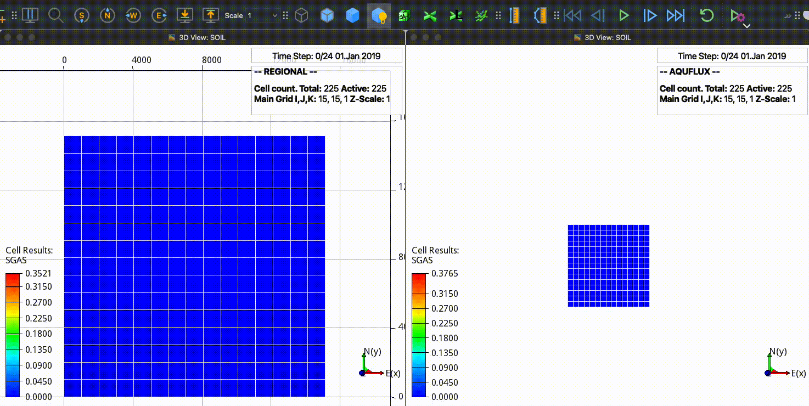

[](https://github.com/daavid00/expreccs/actions/workflows/expreccs.yml)
<a href="https://www.python.org/"></a>
[](https://github.com/ambv/black)
[](https://www.gnu.org/licenses/gpl-3.0)

# Expansion of ResourCes for CO2 Storage on the Horda Platform (ExpReCCS)



This repository contains scripts to set up a workflow to run site and regional reservoirs
for CO2 storage using the [_OPM-Flow_](https://opm-project.org/?page_id=19) simulator.

## Installation
You will first need to install
* Flow (https://opm-project.org)

There are active pull requests to the master branches of OPM to update the boundary conditions
in the schedule section. Then, for now you need to build OPM from source and clone the branches
bc_schedule. To build dune and the corresponding OPM branches from source, you can run the script
`./build_dune_and_opm-flow.bash`, which in turn should build flow in the folder 
./build/opm-simulators/bin/flow.

You can install the Python requirements in a virtual environment with the following commands:

```bash
# Clone the repo
git clone https://github.com/daavid00/expreccs.git
# Get inside the folder
cd expreccs
# Create the virtual environment
python3 -m venv vexpreccs
# Activate the virtual environment
source vexpreccs/bin/activate
# Upgrade pip, setuptools, and wheel
pip install --upgrade pip setuptools wheel
# Install the expreccs package
pip install .
``` 

## Running expreccs
You can run _expreccs_ as a single command line:
```
expreccs -i some_input.txt -o some_output_folder
```
Run `expreccs --help` to see all possible command line 
argument options. Inside the `some_input.txt` file you provide the path to the
flow executable and simulation parameters. See the .txt files in the examples
folders.

## Getting started
See the [_documentation_](https://daavid00.github.io/expreccs/introduction.html). 

## About expreccs
The expreccs package was funded by Wintershall Dea, Equinor, Shell, and the Research Council of Norway [project number 104908].
This is work in progress. [_Here_](https://www.norceresearch.no/en/projects/expansion-of-resources-for-co2-storage-on-the-horda-platform-expreccs) is the link to the project details.
Contributions are more than welcome using the fork and pull request approach.