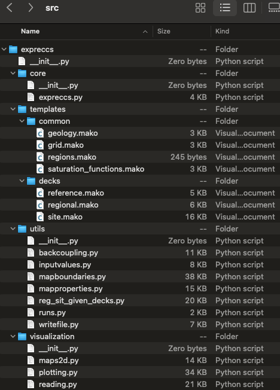

===================
expreccs Python API
===================

The main script for the **expreccs** executable is located in the core folder.
The expreccss folder contains mako files to generate the corresponding opm
input decks. The scripts in the utils folder process the input configuration
file, runs the reference, regional, and site simulations, and generate images (.png) to show
comparisons between the different runs.

    Files in the expreccs package.

.. include:: modules.rst