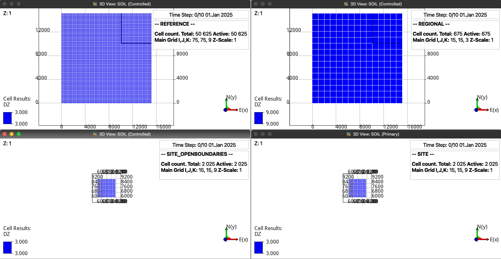
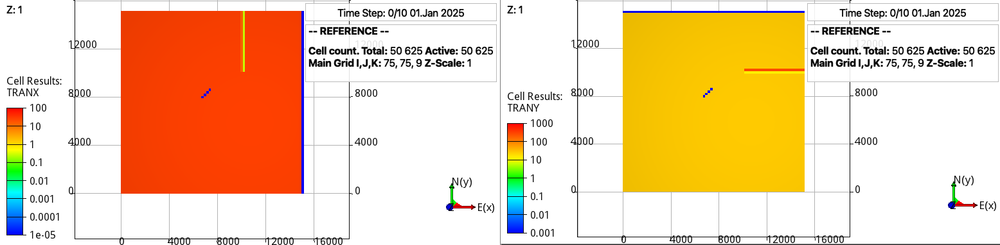
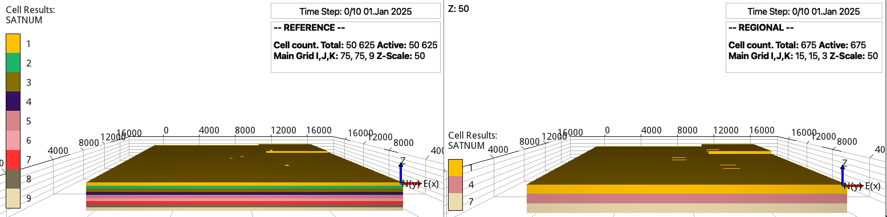

==================
Configuration file
==================

The first input parameter in the configuration file is:

.. code-block:: python
    :linenos:

    """Set the full path to the flow executable and flags"""
    flow --enable-opm-rst-file=true 

If **flow** is not in your path, then write the full path to the executable
(e.g., /Users/dmar/Github/opm/build/opm-simulators/bin/flow). We also add in the same 
line as many flags as required (see the OPM Flow documentation `here <https://opm-project.org/?page_id=955>`_).

.. note::
    If you have installed flow with MPI support, then you can run the simulations in
    parallel by adding **mpirun -np N flow ...** where N is the number of cpus.

****************************
Reservoir-related parameters
****************************

The following input lines are:

.. code-block:: python
    :linenos:
    :lineno-start: 4

    """Set the model parameters"""
    15150 15150 27                  #Reginonal aquifer length, width, and depth [m]
    15 15 3                         #Number of x-, y-, and z-cells [-] 
    6060 6060 0 9090 9090 27        #Site xi, yi, zi, xf, yf, and zf box positions [m]
    15 15 9                         #Number of x-, y-, and z-cells in the site reservoir [-]
    10100 10100 0 0.01 10           #Regional fault x, y, and z positions [m] and x and y multipliers for the trans
    6565 7777 0 7979 8383 0 0.0 0.0 #Site fault x, y, and z positions [m] (initial and final) and x and y multipliers for the trans
    9                               #Number of layers  

Here we first set the dimensions of the regional model and the number of cells for the discretization,
where the origen is located in the left bottom corner. Then the site model is defined by giving the coordinates
of a box, and right after the discretization is set, which also defines the grid size for the reference simulations.

    The four different grids created by the previous lines. The reference case have the same grid size as the site 
    cases, while the regional model have grid sizes 5 times larger in the xy directions and 3 times larger in the
    z direction. The location of the site model in the regional model is also depicted in the upper-left corner in 
    this documentation (the 9 blue cells correspond to the site location).

The following line defines a fault along the z-direction in the regional model, where the first three entries define the
position of the fault extending from the top and right boundaries, while the last two entries define the multipliers for 
the transmissibilities in the x and y directions. Similarly it is possible to define a fault in the site model, which extends
from the given initial location and continues in zig-zag until the given final location. 

    Visualization of the transmissibilities in the x (left) and y (right) direction in the reference grid.

Finally, we set the number of layers along the z direction, which allows to consider different rock and saturation function properties.

    The number of the rocks for the (left) site/reference and (right) regional decks. We observe that for the regional model the lowest
    number of the rock is kept in the coarser cell. 

***********************
Rock-related parameters
***********************
The following entries define the rock related parameters:

.. code-block:: python
    :linenos:
    :lineno-start: 13

    """Set the saturation functions"""
    krw * (sew) ** 1.5       #Wetting rel perm saturation function [-]
    krc * (1 - sew) ** 1.5   #Non-wetting rel perm saturation function [-]
    pec * sew ** (-(1./1.5)) #Capillary pressure saturation function [Pa]  

In this example we consider properties for the sands number 1 to 5 as described in the 
`11th SPE CSP <https://www.spe.org/en/csp/>`_:

.. code-block:: python
    :linenos:
    :lineno-start: 18

    """Properties sat functions"""
    """swi [-], swrg [-], krg [-], krw [-],pe [Pa]"""
    SWI5 0.12 SWRG5 0.10 KRW5 1. KRG5 1. PRE5 3060.00
    SWI4 0.12 SWRG4 0.10 KRW4 1. KRG4 1. PRE4 3870.63
    SWI5 0.12 SWRG5 0.10 KRW5 1. KRG5 1. PRE4 3060.00
    SWI4 0.12 SWRG4 0.10 KRW4 1. KRG4 1. PRE5 3870.63
    SWI1 0.32 SWRG1 0.10 KRW1 1. KRG1 1. PRE1 193531.39
    SWI2 0.14 SWRG2 0.10 KRW2 1. KRG2 1. PRE2 8654.99
    SWI3 0.12 SWRG3 0.10 KRW3 1. KRG3 1. PRE3 6120.00
    SWI2 0.14 SWRG2 0.10 KRW2 1. KRG2 1. PRE2 8654.99
    SWI3 0.12 SWRG3 0.10 KRW3 1. KRG3 1. PRE3 6120.00

Simillarly for the rock properties:

.. code-block:: python
    :linenos:
    :lineno-start: 30

    """Properties rock"""
    """K [mD], phi [-]"""
    PERM5 1013.25 PORO5 0.25
    PERM4 506.625 PORO4 0.20
    PERM5 1013.25 PORO5 0.25
    PERM4 506.625 PORO4 0.20
    PERM1 0.10132 PORO1 0.10
    PERM2 101.324 PORO2 0.20
    PERM3 202.650 PORO3 0.20
    PERM2 101.324 PORO2 0.20
    PERM3 202.650 PORO3 0.20

As seen from the previous values, the finnest sand corresponds to No. 1 and it gets coarser
towards sand No. 5.

***********************
Well-related parameters
***********************

Now we proceed to define the location of the wells:

.. code-block:: python
    :linenos:
    :lineno-start: 42

    """Wells position"""
    """x, y, and z position [m]"""
    7180   7180 5  #Well 1 
    7970   7970 5  #Well 2
    10605 10605 5  #Well 3 
    10605  4545 5  #Well 4

The implementation allows to add as many wells as desired in the site and regional model.

.. figure:: figs/wells.png

    The location of the wells in the four different grids. We observe that for the regional model
    wells 0 and 1 in the site location share the same cells along the z-direction. Then the approach
    is to project the fluxes/presures on the site boundaries from the regional simulations.    

The injection rates are given in the following entries:

.. code-block:: python
    :linenos:
    :lineno-start: 49

    """Define the injection values 'inj[]'""" 
    """injection time [d], time step size to write results [d], injection rates [kg/day], injected fluid (0 water, 1 co2)"""
    73. 73. 3e5 1 3e5 1 5e6 1 0 0
    73. 73. 3e5 1 3e5 1 5e6 1 0 0
    73. 73. 3e5 1 3e5 1 5e6 1 0 0
    73. 73. 3e5 1 3e5 1 5e6 1 0 0
    73. 73. 3e5 1 3e5 1 5e6 1 0 0
    73. 73. 3e5 1 3e5 1 0 0 5e6 1
    73. 73. 3e5 1 3e5 1 0 0 5e6 1
    73. 73. 3e5 1 3e5 1 0 0 5e6 1
    73. 73. 3e5 1 3e5 1 0 0 5e6 1
    73. 73. 3e5 1 3e5 1 0 0 5e6 1 

Since we defined four wells (two of them inside the site model), then each row of the schedule has 10 entries, corresponding to
the first two defining the injection time and number of restart files in the solution, and 2*4 additional entries to define the injection 
rates and injected fluid from well 1 to well 4 respectively. 

.. warning::
    Keep the linebreak between the sections in the whole configuration file (in the current implementation this is used for the reading of the parameters).
