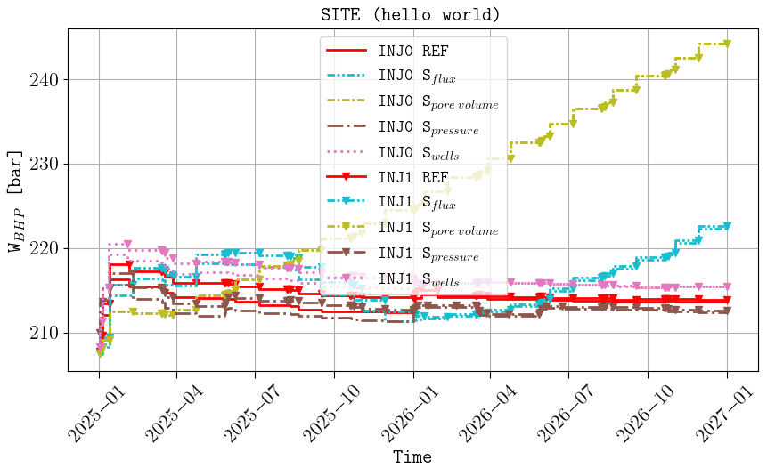
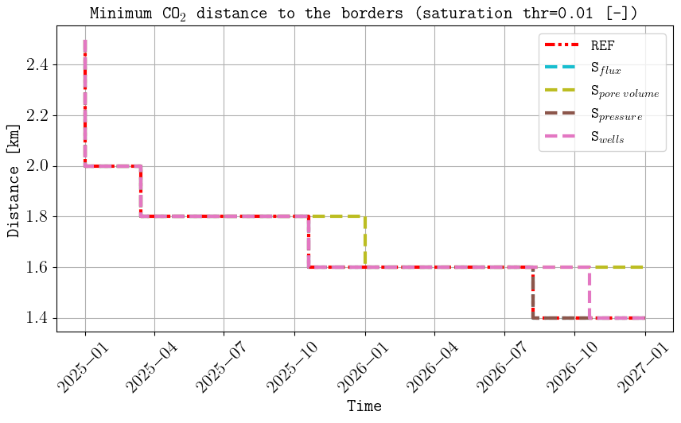
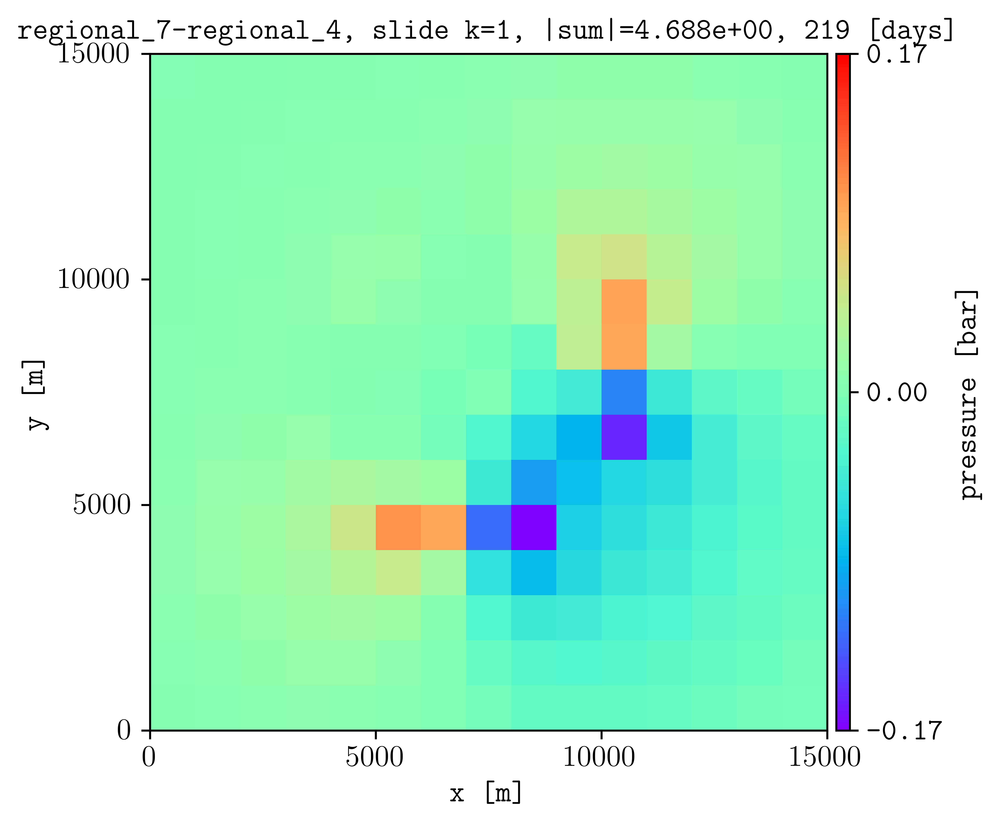

********
Examples
********

Example 1
---------

We consider the configuration file `example1.txt <https://github.com/cssr-tools/expreccs/blob/main/examples/example1.txt>`_ in the 
examples folder (the animation in the `GitHub home page <https://github.com/cssr-tools/expreccs>`_ was based on this configuration file). 
If the results are to be saved in a folder called 'hello_world', this is achieved by the following command: 

.. code-block:: bash

    expreccs -i example1.txt -o hello_world

Then we can change in line 14 the BC projections from the regional simulations from
'flux' to 'pres', and run the following command to only simulate the site model:

.. code-block:: bash

    expreccs -i example1_pres.txt -o hello_world -m site

We can do the same to add the pore volumes from the regional reservoir on the site boundaries by setting in line 14
'porvproj', and to also visualize the results in PNGs figures, we run the following command:

.. code-block:: bash

    expreccs -i example1_porvproj.txt -o hello_world -m site

Finally, we consider the case where we add injector/producers on the site boundary, and to also visualize the results 
in PNGs figures, we run the following command:

.. code-block:: bash

    expreccs -i example1_wells.txt -o hello_world -m site -p yes

Below are some of the figures generated inside the postprocessing folder:

.. figure:: figs/hello_world_reference_watfluxi+.png
    :scale: 80%
.. figure:: figs/hello_world_regional_watfluxi+.png
    :scale: 80%
.. figure:: figs/hello_world_site_flux_watfluxi+.png
    :scale: 80%

    Final water velocity (m/day) in the x direction for (top) the reference, (middle) regional, and 
    (bottom) site (with fluxes as BC). The figure names in the postprocessing folder are hello_world_reference_watfluxi+.png,
    hello_world_regional_watfluxi+.png, and hello_world_site_flux_watfluxi+.png respectively. 

.. figure:: figs/hello_world_sensor_pressure_over_time.png

    
    Comparison of cell pressures on the sensor location (top), well BHPs (middle), and minimum
    distance from the CO2 plume to the site boundaries (bottom). The figure names in the postprocessing folder are 
    hello_world_sensor_pressure_over_time.png, hello_world_summary_BHP_site_reference.png, and 
    hello_world_distance_from_border.png respectively

Example 2
---------

The configuration file example2.txt set a more complex geological model with more grid cells (1 417 500). This was used
to generate the animation (using ResInsight) in the :doc:`introduction section <./introduction>` by running

.. code-block:: bash

    expreccs -i example2.txt -m reference

Generic (under development)
---------------------------

See/run the `test_generic_deck.py <https://github.com/cssr-tools/expreccs/blob/main/tests/test_generic_deck.py>`_ 
for an example where **expreccs** is used in two given models (regional and site, in this case they are created using
the **expreccs** package, but in general can be any given geological models), generating a new input deck where
the pressures are projected.

.. code-block:: bash

    expreccs -e name_of_folder_for_the_regional_model,name_of_folder_for_the_site_model

.. _back_coupling:

Back-coupling (under development)
---------------------------------

We consider the configuration file `example1_back.txt <https://github.com/cssr-tools/expreccs/blob/main/examples/example1_back.txt>`_ in the examples folder.
The plan is to update properties (e.g., transmissibility multipliers) in the regional model from features (e.g., faults) in the site model (i.e., not included in the regional model).
By running:

.. code-block:: bash

    expreccs -i example1_back.txt -o back-coupling -m all -p yes

This is one of the generated figures in the back-coupling/postprocessing folder (named as back-coupling_summary_BPR_regional_reference.png):

.. image:: ./figs/back-coupling_summary_BPR_regional_reference.png

The figures in the postprocessing includes the results for the first two iterations and the last one (in this case 9 since the number of 
iteration is set to 10 in line 22 of the `configuration_file <https://github.com/cssr-tools/expreccs/blob/main/examples/example1_back.txt>`_). To visualize/compare results
between any of the iterations, we can use our friend `plopm <https://github.com/cssr-tools/plopm>`_. 

.. tip::
    You can install `plopm <https://github.com/cssr-tools/plopm>`_ by executing in the terminal: **pip install git+https://github.com/cssr-tools/plopm.git**.

For example, to show the difference in the spatial maps for pressure between iteration 4 and 7 at the third restart, this is achieved by executing:

.. code-block:: bash

    plopm -i back-coupling/output/regional_7/regional_7 -diff back-coupling/output/regional_4/regional_4 -v pressure -r 3 -s ,,1 -c rainbow -cformat .2f -d 5,5

and to show the comparison for the summary vector FPR for iterations 1, 5, 7, and 9:

.. code-block:: bash

    plopm -i 'back-coupling/output/regional_1/regional_1 back-coupling/output/regional_5/regional_5 back-coupling/output/regional_7/regional_7 back-coupling/output/regional_9/regional_9' -v fpr -d 5,5 -f 10

.. image:: ./figs/fpr_plopm.png