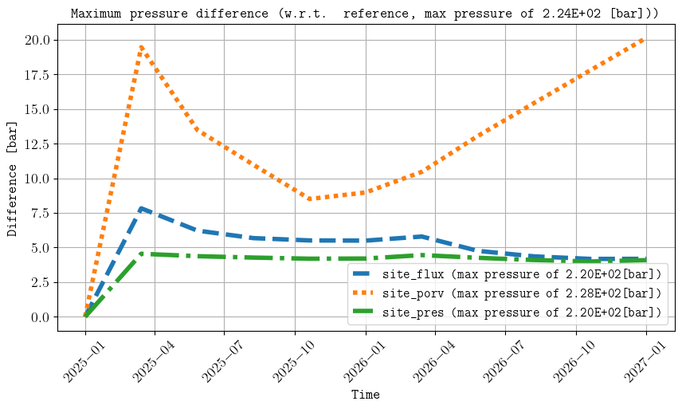
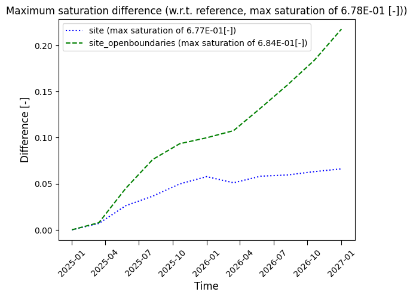
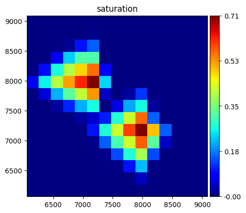
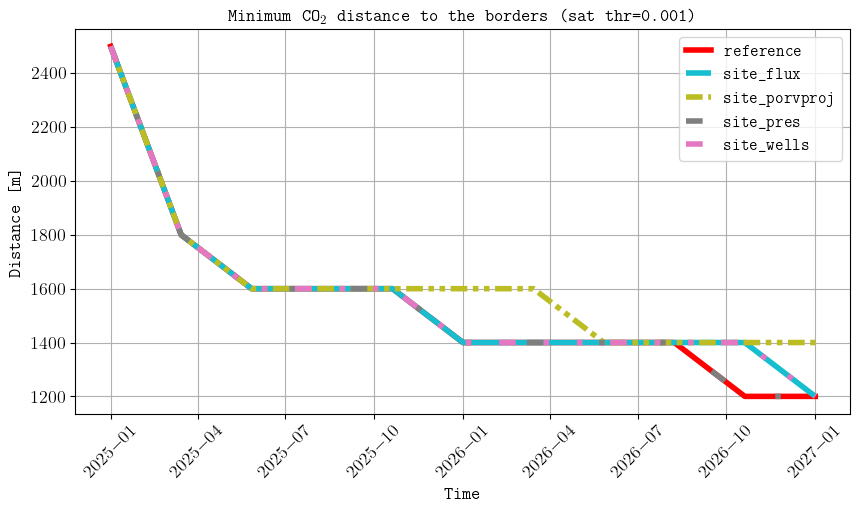

********
Examples
********

Test
----

In this example we consider the configuration file described in the
:doc:`configuration file<./configuration_file>` section, which is available in the 
examples folder and also used for the testing of the framework by pytest 
(`link to the file <https://github.com/daavid00/expreccs/blob/main/examples/input.txt>`_).

If the configuration file is saved as 'example.txt' and the generated files are to be
saved in a folder called 'results', then this is achieved by the following command:

.. code-block:: bash

    expreccs -i example.txt -o results

The execution time was less than a minute and the following is a screenshot using
ResInsight to visualize the gas saturation:

.. figure:: figs/test_saturation.png

    Simulation results of the gas saturation at the end of the simulations.

To measure the error w.r.t. the referenece simulations, the following plots
are created by the **expreccs** executable:

.. figure:: figs/test_distance_from_border.png
    
    Comparison of (top) pressure, (middle) gas saturation, and (botton) minimum
    distance from the CO2 plume to the site boundaries. 

We observe that for this example using the fluxes from the regional model on the site simulation
results in better predictions as compared to the site simulations with open boundaries (constant
pressure conditions).

.. note::
    The current implementation projects the fluxes from the regional simulations on the site model
    and only on one cell-face the pressure (see the generated input decks to locate the cell face).

Larger case
-----------

We now increase the number of cells in the site reservoir from [15, 15, 9] to:

.. code-block:: python
    :linenos:
    :lineno-start: 8

    75 75 27                        #Number of x-, y-, and z-cells in the site reservoir [-]s 

This results on 3 796 875 cells on the reference simulation. Then we run the framework on a cluster
with flow and mpi:

.. code-block:: python
    :linenos:
    :lineno-start: 2

    mpirun -np 57 /home/AD.NORCERESEARCH.NO/dmar/Github/opm/build/opm-simulators/bin/flow --enable-opm-rst-file=true --solver-max-time-step-in-days=1

The four simulations finished in less than an hour and the following are some of the generated figures:

.. figure:: figs/reference_saturation.png

    
    Simulation results of the gas saturation (top) in the reference and (middle) site and (bottom) distance 
    from the CO2 plume to the border.

