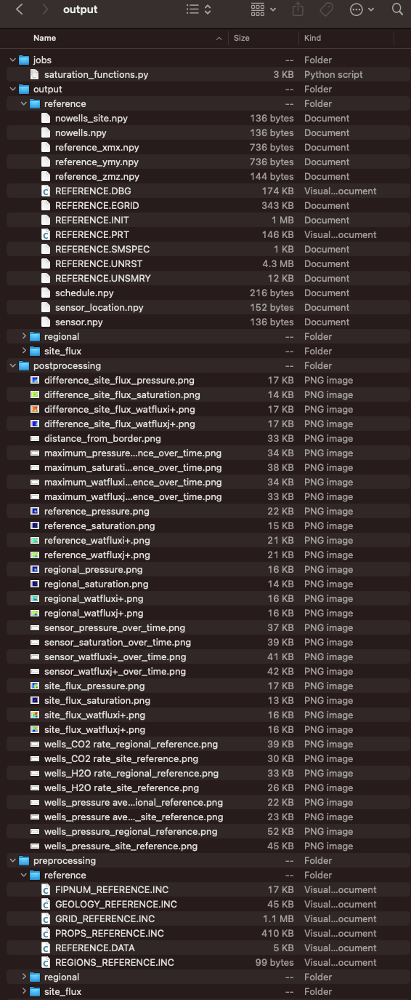

*************
Output folder
*************

=======================
Via configuration files
=======================

The following screenshot shows the generated files in the selected output folder after 
executing **expreccs** in the :ref:`hello_world` example.

    Generated files after executing **expreccs**.

The different simulation results are saved in the simulations folder, and
`ResInsight <https://resinsight.org>`_ and `plopm <https://github.com/cssr-tools/plopm>`_ can be used for the visualization.
Then after running **expreccs**, one could modify the generated OPM related files in
the preprocessing folder and  run directly the simulations calling the Flow solvers, e.g., to add tracers 
(see the OPM Flow documentation `here <https://opm-project.org/?page_id=955>`_).
In addition, some plots comparing the site simulations to the reference 
and the site are generated in the postprocessing folder.

.. tip::

    Running **expreccs** using the flag "-s 0" results in generating the decks and simulation results in the
    given output folder without creating the subfolders preprocessing and simulations.

==================
Via OPM Flow decks
==================

The following screenshot shows the generated files in the selected output folder after 
executing **expreccs**, this corresponds to the `test_generic_deck.py <https://github.com/cssr-tools/expreccs/blob/main/tests/test_generic_deck.py>`_:

.. code-block:: bash

    expreccs -o expreccs -i 'regional/REGIONAL site_closed/SITE_CLOSED'

.. figure:: figs/generic.png

    Generated files after executing **expreccs**.

The dynamic boundary conditions are saved in the expreccs/bc folder, and the definition of the boundary connections in 
expreccs/BCCON.INC. In addition, OPERNUM is used to label de boundary cells in the site, and also to label the overlapping cells and
cells to use for the pressure interpolator in the regional model (regional/OPERNUM_EXPRECCS.INC).