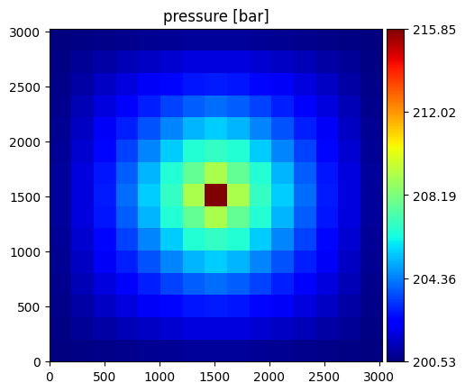
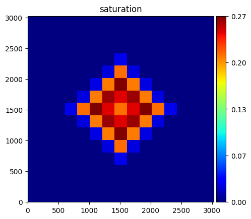
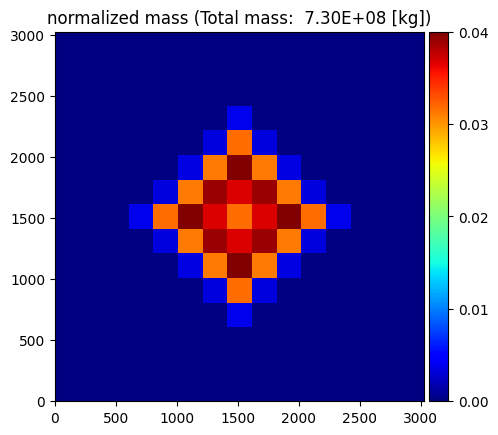

==========
Single run 
==========

In this example we consider the configuration file in the
:doc:`configuration file<./configuration_file>` section.

If the configuration file is saved as 'example.txt' and the generated files are to be
saved in a folder called 'results', then this is achieved by the following command:

.. code-block:: bash

    expreccs -i example.txt -o results

The execution time was less than a second and the following are screenshots of the simulation results:

    Simulation results of the (top) pressure, (middle) saturation, and (bottom) normalized mass.